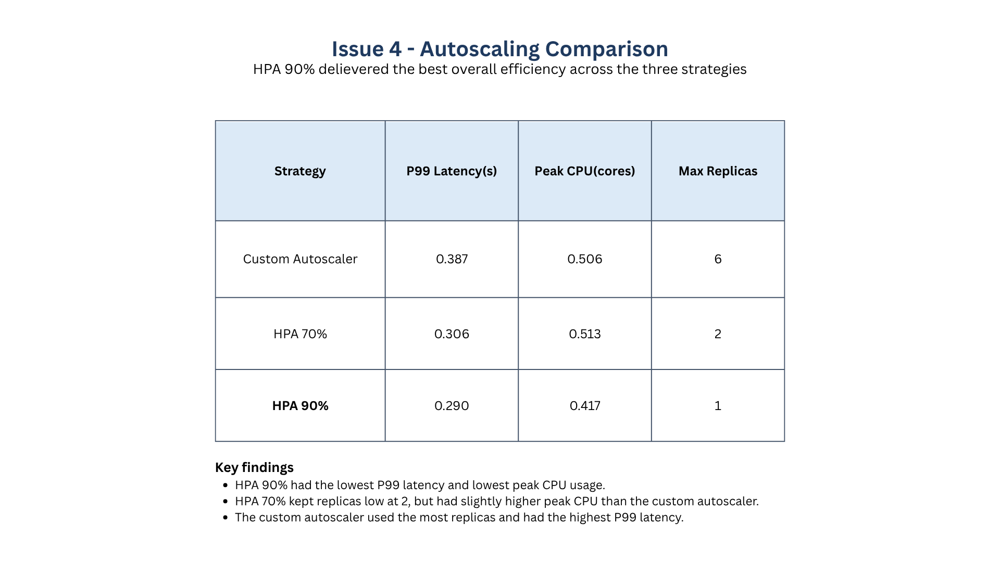

# Kubernetes ML Autoscaling

Machine learning inference service deployed on Kubernetes with a custom autoscaler and comparison against Kubernetes Horizontal Pod Autoscaler (HPA).

## Project Overview

This project deploys a ResNet18 image classification model as a FastAPI service inside Kubernetes. The system is evaluated under load using three scaling strategies:

- Custom Autoscaler
- HPA (70% CPU target)
- HPA (90% CPU target)

Performance is compared using:

- Latency
- CPU utilization
- Number of replicas

---

## Architecture

```text
Client
  |
Load Test
  |
FastAPI Service
  |
ResNet18 Inference
  |
Kubernetes Deployment
  |
+------------------+
| Autoscaling      |
| - Custom         |
| - HPA 70%        |
| - HPA 90%        |
+------------------+
```

## Technologies

- Python
- FastAPI
- PyTorch
- Docker
- Kubernetes
- Minikube
- ResNet18
- Matplotlib

---

## Repository Structure

```text
├── app.py
├── autoscaler.py
├── barazmoon.py
├── barazmoon_test.py
├── load_test.py
├── run_experiment.py
├── cpu_logger.py
├── replicas_logger.py
├── plot.py
├── test.py
│
├── deployment.yaml
├── Dockerfile
├── requirements.txt
├── workload.txt
├── report.txt
│
├── imagenet-sample-images/
│
├── presentation/
│   └── Cloud_Computing_Project.pdf
│
└── README.md
```

---

## Setup

### Start Minikube

```bash
minikube start
minikube addons enable metrics-server
```

### Build Docker Image

```bash
eval $(minikube docker-env)
docker build -t ml-fastapi .
```

### Deploy Application

```bash
kubectl apply -f deployment.yaml
kubectl expose deployment ml-deployment --type=NodePort --port=8000
```

### Verify Deployment

```bash
kubectl get pods
kubectl top pods
```

---

## Running Experiments

Run all experiments automatically:

```bash
python run_experiment.py
```

The script executes:

1. Custom Autoscaler
2. HPA (70%)
3. HPA (90%)

For each experiment it collects:

- Latency
- CPU usage
- Replica count

and stores the results as CSV files.

---

## Custom Autoscaler

The custom autoscaler periodically monitors CPU usage and adjusts the number of replicas according to predefined thresholds.

### Scale Up

```text
CPU > threshold
```

### Scale Down

```text
CPU < threshold
```

Additional features:

- Cooldown period
- Maximum replica limit
- Minimum replica limit

---

## Results

### Latency Comparison


### CPU Utilization Comparison


### Replica Count Comparison


### Overall Comparison


---

## Conclusion

The project evaluates the effectiveness of a custom autoscaler compared to Kubernetes HPA under identical workloads.

The experiments demonstrate how different scaling strategies affect:

- Service latency
- Resource utilization
- Scalability

and highlight the trade-offs between aggressive and conservative scaling policies.

---
